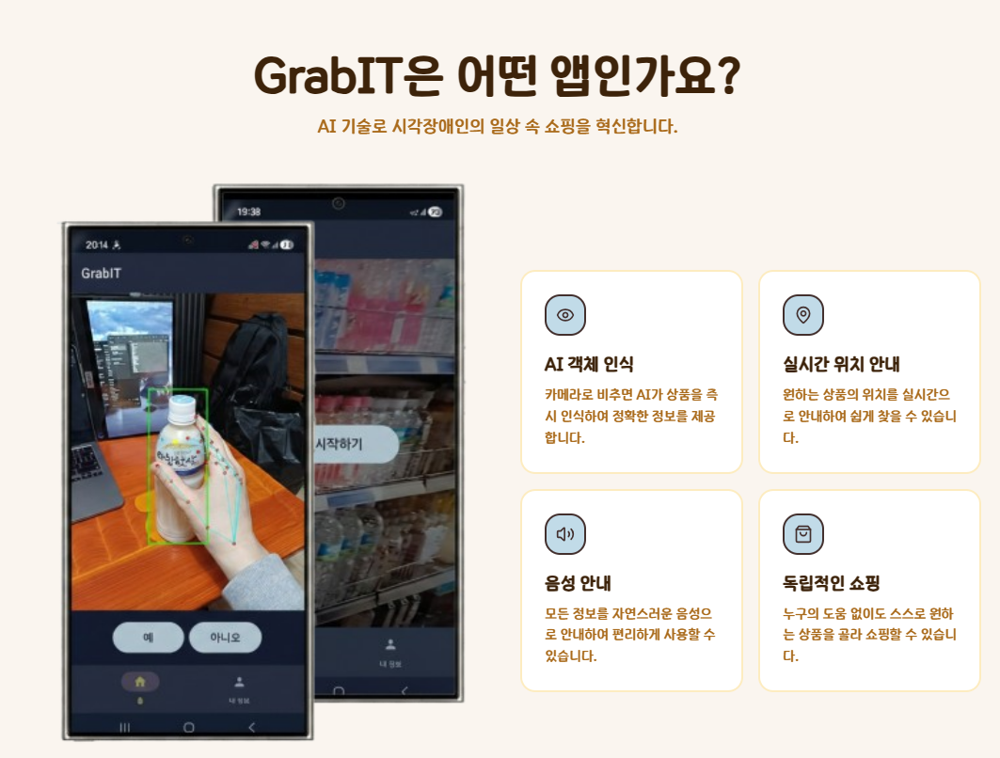
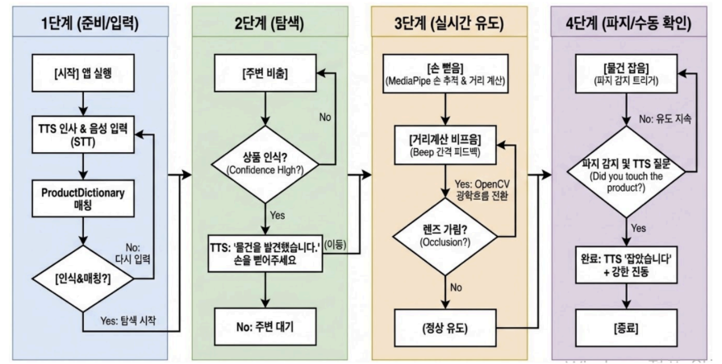

# GrabIT Android

> 시각장애인과 저시력자를 위한 온디바이스 AI 기반 실시간 상품 인식 및 음성 안내 Android 앱

<table align="center">
  <tr>
    <td align="center" width="680">
      <a href="https://www.notion.so/8ac441f66d78821492c2019c4fc233cf?pvs=1"><b>📘 Notion Project Page</b></a><br />
      <sub>프로젝트 상세 문서 · 구현 과정 · 역할 정리 보기</sub>
    </td>
  </tr>
</table>

<p align="center">
  
  
</p>

## ✨ Highlights

| 구분 | 내용 |
|---|---|
| 문제 | 시각장애인과 저시력자가 매장에서 원하는 상품을 직접 찾기 어려움 |
| 해결 | 온디바이스 객체 탐지 + 손 추적 + 음성/비프음 안내 |
| 담당 | YOLOX-Nano 학습, TFLite/LiteRT 변환, Android 연동, 접근성 UX 흐름 설계 |
| 결과 | 실시간 상품 인식과 손 위치 기반 안내 기능 구현 |

---

## 1. 프로젝트 개요

GrabIT은 시각장애인 및 저시력자가 매장 진열대 앞에서 원하는 상품을 더 쉽게 찾을 수 있도록 돕는 Android 애플리케이션입니다.

카메라로 상품을 인식하고, 사용자의 손가락 위치를 추적하며, 음성 안내와 비프음 피드백을 통해 화면을 보기 어려운 상황에서도 목표 상품의 위치를 직관적으로 안내하는 데 초점을 맞췄습니다.

---

## 2. 사용자 시나리오

<p align="center">
  
</p>

```text
상품명 음성 입력
  → 유사어 검색 / 상품군 매칭
  → 카메라 기반 실시간 상품 인식
  → 손가락 위치 추적
  → 목표 상품과 손 위치 거리 계산
  → 음성 안내 + 비프음 피드백
```

---

## 3. 주요 기능

| 기능 | 설명 |
|---|---|
| 실시간 상품 인식 | YOLOX-Nano 모델을 TensorFlow Lite로 변환해 온디바이스 추론 수행 |
| 손 추적 | MediaPipe Hands로 손가락 끝 좌표를 추적 |
| 음성 제어 | STT / TTS 기반으로 화면을 보지 않고 앱 제어 |
| 비프음 피드백 | 목표 상품과 가까워질수록 비프음 간격을 짧게 조절 |
| 검색 기록 | Room Database 기반 최근 검색 기록 저장 |
| 유사어 검색 | E5 embedding 기반으로 구어체 표현을 정식 상품명과 매칭 |
| 상품 규격 API | 상품 크기 정보를 앱에 전달해 거리 계산 보조 |

---

## 4. My Role

- YOLOX-Nano 기반 상품 인식 모델 학습
- PyTorch 모델을 TensorFlow Lite / LiteRT 배포 형태로 변환
- Android 앱 내 온디바이스 추론 흐름 연결
- MediaPipe 손 추적 결과와 상품 박스 간 거리 기반 피드백 설계
- STT/TTS 기반 접근성 UX 흐름 정리
- Node.js / FastAPI 기반 유사어 검색 및 상품 규격 API 연동

---

## 5. Tech Stack

| 영역 | 기술 |
|---|---|
| Android | Kotlin, Android Studio |
| Architecture | MVVM |
| On-Device AI | YOLOX-Nano, TensorFlow Lite, LiteRT |
| Vision | CameraX, MediaPipe Hands |
| Voice | SpeechRecognizer, TextToSpeech |
| Local DB | Room Database |
| Backend | Node.js, Express, FastAPI |
| NLP | intfloat/multilingual-e5-small, cosine similarity |
| Database | MongoDB |
| Network | Retrofit2, OkHttp3 |
| Infra | Docker, Docker Compose |

---

## 6. System Flow

```text
Android CameraX
  → YOLOX-Nano TFLite inference
  → 상품 bounding box 추출
  → MediaPipe Hands 손가락 좌표 추적
  → 목표 상품과 손 위치 거리 계산
  → TTS / Beep feedback
```

---

## 7. Backend API

GrabIT은 앱 내부 모델 추론 외에도 상품명 매칭과 상품 규격 정보 제공을 위해 백엔드 API를 함께 사용합니다.

| 서버 | 역할 |
|---|---|
| Node.js API | 상품 정보, 유사어 검색 요청, 규격 정보 제공 |
| FastAPI E5 Service | 텍스트 임베딩 생성 및 유사도 계산 |
| MongoDB | 상품명, 유사어, 규격 데이터 저장 |

---

## 8. How to Run

### Android App

```bash
# Android Studio에서 프로젝트 열기
# Gradle Sync 후 실제 Android 기기에서 실행 권장
```

### Backend

```bash
docker-compose up --build -d
node seed.js
node seed-dimensions.js
```

---

## 9. Repository

```text
app/                 Android app source
server/              Node.js API server
e5-service/          FastAPI embedding service
docker-compose.yml   backend service orchestration
```
