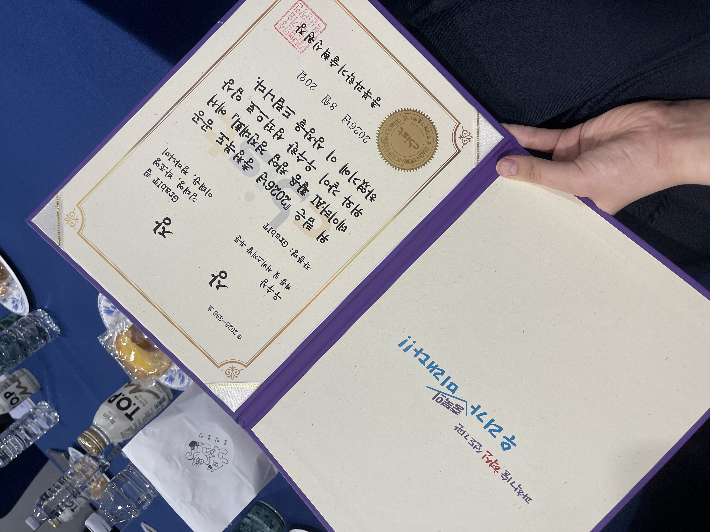
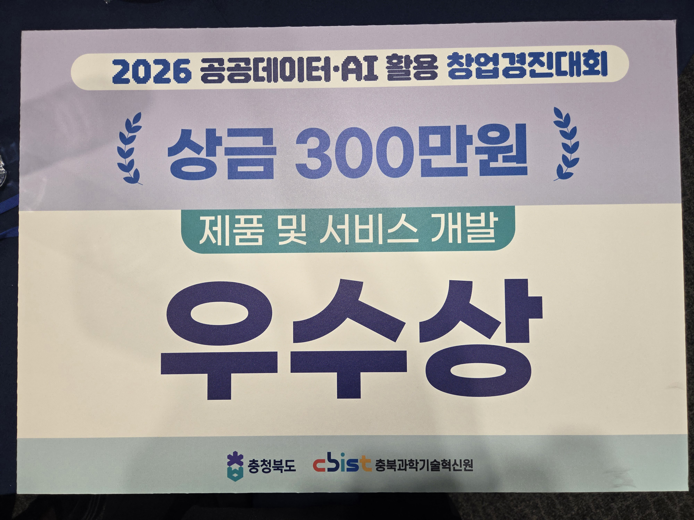
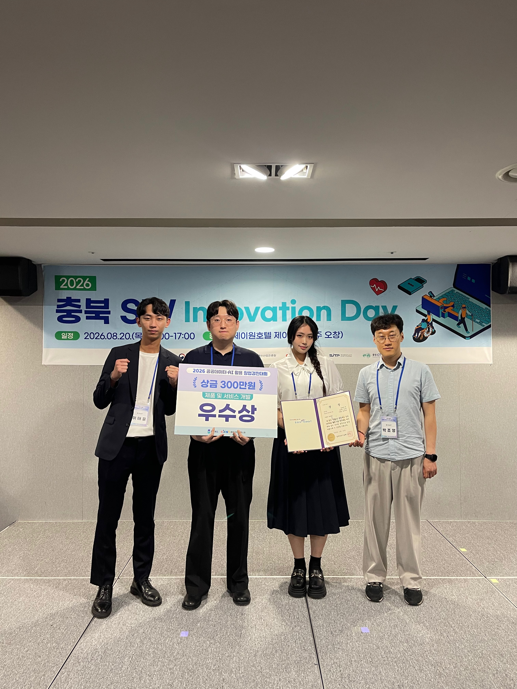
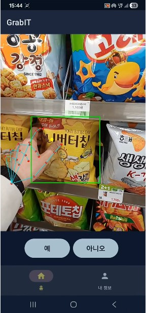
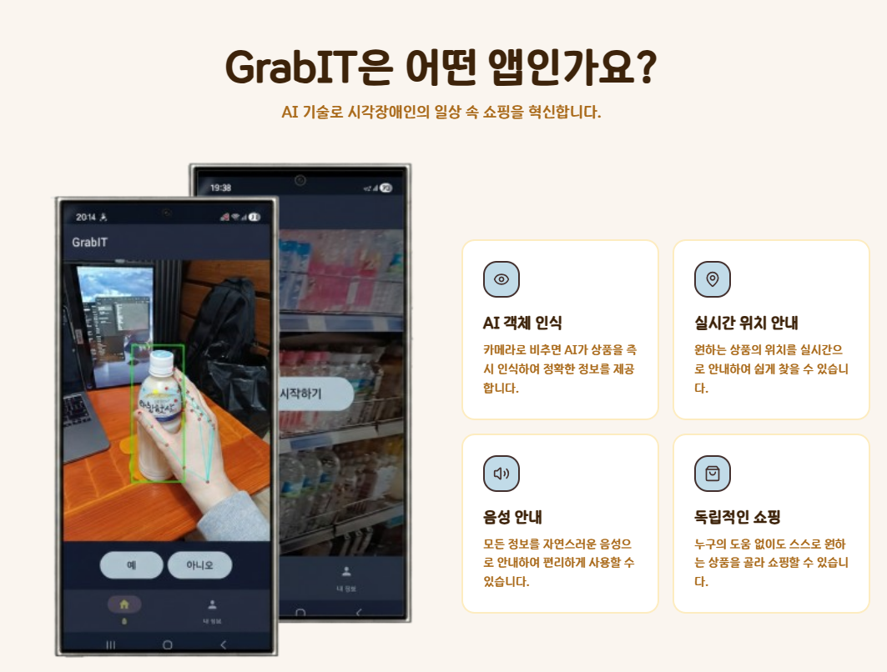
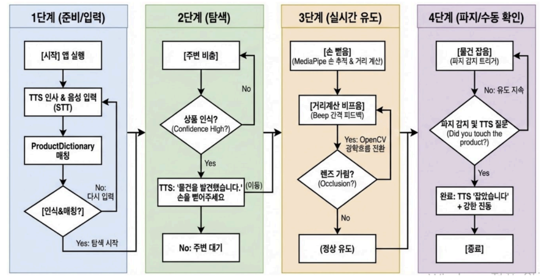

# GrabIT Android

> **시각장애인의 독립적인 상품 탐색을 지원하는 온디바이스 AI 기반 실시간 쇼핑 어시스턴트**

<p align="center">
  <b>🏆 2026 충북 공공데이터·AI 활용 창업경진대회 우수상</b>
</p>

<table align="center">
  <tr>
    <td align="center" width="680">
      <a href="https://app.notion.com/p/_-377441f66d7880a6bf29fae9e4a5624e?source=copy_link"><b>📘 Notion Portfolio</b></a><br />
      <sub>프로젝트 배경 · 기술 선택 · 구현 과정 · 공공데이터 활용 · 수상 성과</sub>
    </td>
  </tr>
</table>

---

## 🏆 Award

KDT 국비지원 부트캠프에서 시작한 GrabIT을 공공데이터 기반 서비스로 추가 고도화하여
**2026 충북 공공데이터·AI 활용 창업경진대회에서 우수상**을 수상했습니다.

<p align="center">
  
  
  
</p>

---

## 🎬 Demo

https://github.com/user-attachments/assets/4c5dc1ac-ce55-4b0b-b4d7-75098fa5151e

<p align="center">
  
  
</p>

---

## ✨ Highlights

| 구분 | 내용 |
|---|---|
| 문제 | 시각장애인이 매장 진열대에서 원하는 상품을 직접 구별하고 선택하기 어려움 |
| 해결 | 온디바이스 상품 탐지 + 상품 위치 추적 + 손 추적 + 음성/비프음/진동 안내 |
| 상품 인식 | YOLOX-Nano FP16 · LiteRT/TFLite · 49개 상품 클래스 |
| 음성 안전장치 | RMS 기반 VAD + TitaNet-S 화자검증 + Android SpeechRecognizer |
| 자연어 검색 | 로컬 상품명·별칭 우선 매칭 + E5 embedding 서버 fallback |
| 개인정보 | 실시간 카메라 프레임을 서버로 전송하지 않고 기기 내부에서 비전 추론 |
| 성과 | **2026 충북 공공데이터·AI 활용 창업경진대회 우수상** |

---

## 1. 프로젝트 개요

GrabIT은 시각장애인이 마트나 편의점의 진열대 앞에서 원하는 상품을 직접 찾고 선택할 수 있도록 지원하는 Android 애플리케이션입니다.

기존의 OCR·바코드 중심 접근성 서비스에서 한 단계 더 나아가, 사용자가 원하는 **특정 상품을 목표로 설정하고 실제 상품 위치까지 접근하는 과정**을 지원하는 데 초점을 맞췄습니다.

카메라 영상의 핵심 비전 처리는 스마트폰 내부에서 수행하며, 상품 검색은 로컬 데이터를 우선 사용하고 필요한 경우에만 의미 검색 서버를 활용하는 하이브리드 구조입니다.

---

## 2. 사용자 시나리오

<p align="center">
  
</p>

```text
사용자 음성 입력
  → 발화 구간 확인(VAD)
  → 등록 사용자 화자검증(TitaNet-S)
  → Android SpeechRecognizer로 상품명 인식
  → 로컬 상품명·별칭 우선 검색
  → 미매칭 시 E5 의미 검색
  → 목표 상품 설정
  → CameraX 실시간 프레임 입력
  → YOLOX-Nano 온디바이스 상품 탐지
  → Optical Flow 기반 위치 추적 보완
  → 방향·거리 계산
  → MediaPipe Hands 손 위치 추적
  → TTS / 비프음 / 진동으로 접근 안내
```

---

## 3. 주요 기능

| 기능 | 설명 |
|---|---|
| 실시간 상품 인식 | YOLOX-Nano FP16 모델을 LiteRT/TFLite 형태로 변환해 스마트폰에서 직접 추론 |
| 상품 위치 안정화 | Optical Flow로 이전 탐지 결과를 프레임 간 추적해 순간적인 탐지 누락과 위치 흔들림 보완 |
| 손 추적 | MediaPipe Hands로 손가락 좌표를 추적하고 목표 상품과의 접근 상태 확인 |
| 방향·거리 안내 | 상품 bounding box와 화면 중심, 상품 규격 정보를 이용해 탐색 방향과 대략적인 거리 계산 |
| 화자 검증 | AudioRecord 기반 발화 수집 후 TitaNet-S ONNX 모델로 등록 사용자 여부를 확인해 STT 실행을 제어 |
| 음성 제어 | Android SpeechRecognizer / TextToSpeech 기반으로 화면을 보지 않고 검색 및 안내 수행 |
| 접근성 피드백 | 목표 상품 방향과 접근 상태를 음성, 비프음, 진동 패턴으로 전달 |
| 로컬 우선 상품 검색 | 앱 내부 상품명·별칭을 먼저 확인하고 로컬에서 찾지 못한 표현만 서버 의미 검색으로 전달 |
| 의미 검색 | multilingual-E5 embedding과 cosine similarity로 구어체 표현을 정식 상품명과 매칭 |
| 검색 기록 | Room Database 기반 최근 검색 기록 관리 |
| 상품 규격 데이터 | 상품의 실제 크기 정보를 로컬/서버에서 조회해 거리 계산을 보조 |

---

## 4. On-Device Vision

### YOLOX-Nano

모바일 환경에서는 단순 정확도뿐 아니라 **모델 크기, 추론 지연, 발열, 실시간성**을 함께 고려해야 했습니다.

- 49개 상품 클래스를 탐지하는 YOLOX-Nano 모델 학습
- PyTorch checkpoint를 FP16 TFLite/LiteRT 형태로 변환
- 최종 49-class 모델 크기 약 **4.4 MB**
- CameraX `ImageAnalysis` 프레임에서 온디바이스 추론
- 실시간 카메라 프레임은 서버로 전송하지 않음

### Optical Flow + MediaPipe Hands

YOLO 탐지가 순간적으로 끊기거나 카메라가 이동할 때 안내 좌표가 크게 흔들리지 않도록 `OpticalFlowTracker`를 이용해 상품 위치 추적을 보완했습니다.

또한 상품을 단순히 화면에서 찾는 것에 그치지 않고 사용자의 손이 목표 상품에 접근하는 과정을 확인하기 위해 MediaPipe Hands를 함께 사용했습니다.

```text
YOLOX Detection
  → target bounding box
  → Optical Flow tracking
  → 상품 위치 / 방향 계산

MediaPipe Hands
  → finger landmark
  → 상품 bbox와 손 위치 비교
  → 접근 상태 피드백
```

---

## 5. Speaker Verification & Voice Flow

매장 환경에서는 주변 사람의 대화나 매장 방송이 음성 명령으로 오인될 수 있습니다.
GrabIT은 **화자검증을 STT 앞단의 gate로 배치**해 등록 사용자의 발화일 때만 상품 검색을 진행하도록 구성했습니다.

### Android 적용 구조

```text
AudioRecord
  → 16 kHz audio preprocessing
  → RMS 기반 발화 구간 확인
  → TitaNet-S ONNX Runtime inference
  → speaker embedding
  → 등록 voiceprint와 cosine similarity 비교
  → accepted: Android SpeechRecognizer 실행
  → rejected: STT 실행 차단 및 사용자 재시도 안내
```

구현에는 다음 구성요소가 포함되어 있습니다.

- `AudioPreprocessor16k` — 화자검증 입력 오디오 전처리
- `TitaNetOnnxRunner` — TitaNet-S ONNX 추론
- `SpeakerVerificationManager` — 등록/검증 플로우 관리
- `VoiceprintStore` — 등록 사용자의 voiceprint 저장
- `VoiceFlowController` — 화자검증 결과와 STT 실행 흐름 연결
- 3회 enrollment sample 기반 사용자 음성 등록
- 검증 완료 후 SpeechRecognizer를 시작해 AudioRecord와 STT 마이크 충돌 방지

### 모델 비교

AI Hub **화자 인식용 음성 데이터**를 활용해 speaker verification 후보 모델을 비교했습니다.
50명 × 500개 음성 샘플 기준 확장 benchmark에서 TitaNet-S가 EER과 latency의 균형이 가장 좋아 Android 적용 모델로 선택되었습니다.

| 모델 | EER | TAR@EER | 평균 latency | 판단 |
|---|---:|---:|---:|---|
| SpeechBrain ECAPA | 8.000% | 92.000% | 156.250 ms | baseline |
| WeSpeaker | 7.717% | 92.286% | 130.595 ms | 비교 후보 |
| TitaNet-L | 7.143% | 92.857% | 66.372 ms | 비교 후보 |
| **TitaNet-S** | **5.714%** | **94.286%** | **41.871 ms** | **최종 적용 후보** |

추가로 서로 다른 3개 LabelText(`찡콩이`, `쭈니야`, `제니야`)에서 TitaNet-S와 WeSpeaker를 재비교했으며,
TitaNet-S는 평균 **EER 5.830%**, 평균 **TAR@EER 94.190%**, 평균 latency **39.295 ms**로 세 조건 모두에서 우세했습니다.

> 위 benchmark는 AI Hub validation subset의 동일 발화 조건에서 수행한 모델 비교 실험이며, 실제 매장 환경의 모든 잡음·거리·기기를 대표하는 수치는 아닙니다.

Android 실제 기기 검증 절차는 [`speaker_verification_android_device_test.md`](./speaker_verification_android_device_test.md)에 정리했습니다.

---

## 6. Local-First Search & Semantic Search

사용자는 데이터베이스에 등록된 정확한 상품명만 말하지 않습니다.
예를 들어 `제로 콜라`, `설탕 없는 콜라`, `칼로리 없는 콜라`처럼 같은 의미를 여러 방식으로 표현할 수 있습니다.

GrabIT은 네트워크 의존도를 줄이기 위해 **local-first** 전략을 사용합니다.

```text
STT 결과
  → 앱 내부 상품명 / 별칭 검색
      ├─ match → 즉시 target class 설정
      └─ no match → 서버 /synonyms/search 요청
                        → multilingual-E5 embedding
                        → cosine similarity
                        → 가장 가까운 상품 후보 반환
```

- 등록된 상품과 별칭은 네트워크 없이 검색 가능
- 로컬에서 찾지 못한 표현만 서버 fallback 사용
- FastAPI E5 service와 Node.js API를 분리해 AI 모델과 일반 API 역할 분담

---

## 7. Public Data & Model Training

공모전 고도화 과정에서는 공공 상품 이미지 데이터를 객체 탐지 학습에 활용했습니다.

원본 데이터에 bounding box 라벨이 존재했지만 일부 라벨이 상품보다 넓거나 주변 배경·인접 상품을 포함하고 있어, 밀집된 진열대 환경에서 특정 상품을 정밀하게 학습하기 위해 라벨 품질을 추가로 보정했습니다.

```text
공공 상품 이미지 데이터 확보
  → 필요한 상품군 선별
  → 기존 bounding box 품질 검토
  → Roboflow Smart Labeling 기반 bbox 재보정
  → 수동 검수
  → YOLOX-Nano 학습
  → FP16 LiteRT/TFLite 변환
  → Android 온디바이스 적용
```

> Segmentation을 새로 수행한 것이 아니라, 기존 **bounding box를 상품 외곽 기준으로 재보정**하고 사람이 다시 검수하는 방식으로 데이터 품질을 높였습니다.

---

## 8. System Architecture

```text
┌──────────────────── Android ────────────────────┐
│                                                 │
│  AudioRecord → VAD → TitaNet-S → SpeechRecognizer
│                          ↓
│                 Local Product Dictionary
│                          ↓ no match
│                     E5 API fallback
│                                                 │
│  CameraX → YOLOX-Nano → Optical Flow            │
│                         ↓                       │
│                 Direction / Distance            │
│                         ↓                       │
│               MediaPipe Hands                   │
│                         ↓                       │
│               TTS / Beep / Haptic               │
└─────────────────────────────────────────────────┘
                         │
                         ▼
             Node.js / FastAPI / MongoDB
```

### 설계 포인트

1. **비전 추론은 온디바이스** — 실시간 카메라 프레임을 서버로 보내지 않습니다.
2. **검색은 로컬 우선** — 등록된 상품명·별칭은 기기 내부에서 해결하고 서버는 fallback으로 사용합니다.
3. **탐지와 추적을 분리** — YOLOX가 상품을 재탐지하고 Optical Flow가 프레임 사이 위치 연속성을 보완합니다.
4. **화자검증과 STT를 분리** — TitaNet-S는 음성을 텍스트로 변환하는 모델이 아니라 등록 사용자 여부를 판단하는 gate로 사용합니다.

---

## 9. My Role

- YOLOX-Nano 기반 49종 상품 인식 모델 학습
- PyTorch 모델을 TensorFlow Lite / LiteRT FP16 배포 형태로 변환
- Android CameraX 기반 온디바이스 추론 흐름 연결
- Optical Flow 기반 상품 위치 추적 및 탐지 안정화
- MediaPipe Hands 결과와 상품 bbox를 활용한 접근 피드백 설계
- STT/TTS 기반 접근성 UX 흐름 정리
- TitaNet-S 기반 화자검증 흐름의 Android 적용 및 테스트
- Node.js / FastAPI 기반 유사어 검색 및 상품 규격 API 연동
- 공공데이터 상품 이미지 선별, bounding box 재보정 및 학습 데이터 품질 개선
- KDT 프로젝트를 공모전 시제품으로 고도화하고 기술 구조·시연·발표 흐름 정리

---

## 10. Tech Stack

| 영역 | 기술 |
|---|---|
| Android | Kotlin, Android Studio, Coroutines |
| Architecture | MVVM |
| Camera | CameraX |
| Object Detection | YOLOX-Nano |
| On-Device Runtime | TensorFlow Lite, LiteRT |
| Tracking | Optical Flow |
| Hand Tracking | MediaPipe Hands |
| Speaker Verification | TitaNet-S, ONNX Runtime |
| Voice | AudioRecord, SpeechRecognizer, TextToSpeech |
| Local DB | Room Database |
| Backend | Node.js, Express, FastAPI |
| NLP | intfloat/multilingual-e5-small, cosine similarity |
| Database | MongoDB |
| Network | Retrofit2, OkHttp3 |
| Infra | Docker, Docker Compose |
| Data | Public product image data, AI Hub speaker recognition dataset, Roboflow |

---

## 11. Backend API

GrabIT은 실시간 카메라 추론을 서버에 의존하지 않습니다.
백엔드는 주로 **상품 데이터 관리와 로컬에서 해결되지 않은 자연어 검색**을 보조합니다.

| 구성 | 역할 |
|---|---|
| Node.js / Express | 상품 정보, 규격, 유사어 검색 API |
| FastAPI E5 Service | 텍스트 임베딩 및 cosine similarity 기반 의미 검색 |
| MongoDB | 상품명, 별칭, 규격 데이터 저장 |
| Room | 최근 검색기록 및 로컬 상품 관련 데이터 관리 |

---

## 12. How to Run

### Android App

```bash
# Android Studio에서 프로젝트 열기
# Gradle Sync 후 실제 Android 기기에서 실행 권장
```

### Backend

```bash
cd synonym-api
docker-compose up --build -d
node seed.js
node seed-dimensions.js
```

---

## 13. Repository Structure

```text
app/
├─ src/main/assets/
│  ├─ yolox_nano_49cls_float16.tflite   # 상품 탐지 모델
│  ├─ titanet_s.onnx                    # 화자검증 모델
│  └─ product_dictionary.json           # 로컬 상품명/별칭
├─ src/main/java/com/example/grabit_test/
│  ├─ HomeFragment.kt
│  ├─ OpticalFlowTracker.kt
│  ├─ SpeakerVerificationManager.kt
│  ├─ TitaNetOnnxRunner.kt
│  ├─ VoiceFlowController.kt
│  └─ ...

synonym-api/
├─ server.js                            # Node.js API
├─ e5-service/                          # FastAPI E5 embedding service
└─ docker-compose.yml

assets/
├─ Award.jpg
├─ Panel.jpg
├─ Team.jpg
├─ Grabit.mp4
├─ grabit-detection-demo.jpg
├─ grabit-service-overview.png
└─ grabit-user-scenario.png
```

---

## 14. Outcome

GrabIT은 단순한 학습용 객체 탐지 예제에서 끝나지 않고,
**실제 Android 앱 안에서 음성 입력 → 상품 검색 → 온디바이스 탐지 → 위치 추적 → 손 접근 확인 → 접근성 피드백**까지 하나의 흐름으로 연결했습니다.

KDT 팀 프로젝트를 기반으로 공공데이터와 AI 기술을 추가 적용하고 사용 흐름을 고도화한 결과,
**2026 충북 공공데이터·AI 활용 창업경진대회 우수상**을 수상했습니다.
